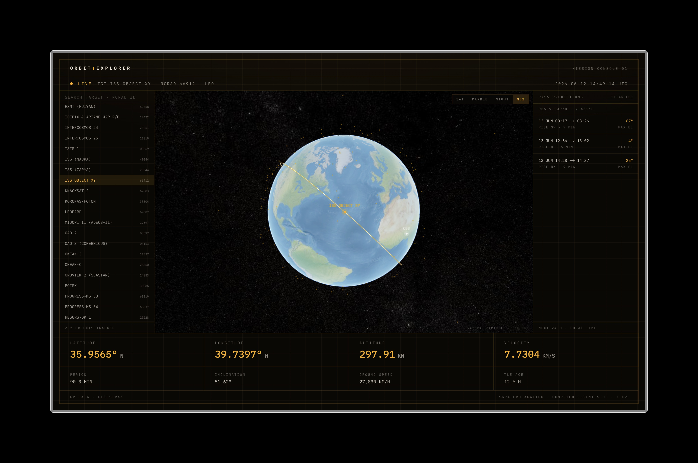

# Orbit Explorer

Track satellites and the ISS in real time — a mission-console style web app that computes orbital positions in your browser.



## Features

- **Live tracking** — positions computed client-side at 1 Hz with SGP4 propagation ([satellite.js](https://github.com/shashwatak/satellite-js)), from CelesTrak orbital elements
- **3D globe** — CesiumJS with the live target marker, orbit path, ground track, and day/night lighting
- **Selectable imagery** — Sentinel-2 cloudless (EOX), NASA Blue Marble, VIIRS city lights, or offline Natural Earth II
- **Multi-satellite catalog** — 200+ tracked objects (space stations, brightest objects, GPS constellation) with search and click-to-target on the globe
- **Pass predictions** — set your ground position and get the next 24 h of passes for the selected target: rise/set times, duration, direction, max elevation
- **Telemetry console** — latitude, longitude, altitude, velocity, period, inclination, ground speed, and TLE age for the selected target

## Stack

- [Next.js](https://nextjs.org) (App Router) + React + TypeScript
- [CesiumJS](https://cesium.com/platform/cesiumjs/) for the 3D globe
- [satellite.js](https://github.com/shashwatak/satellite-js) for SGP4 orbital propagation
- Tailwind CSS

## Getting started

```bash
pnpm install
pnpm dev
```

Open [http://localhost:3000](http://localhost:3000). The `postinstall` script copies Cesium's static assets into `public/cesium`.

## How it works

A route handler (`/api/satellites?group=`) fetches TLE sets from [CelesTrak](https://celestrak.org) and caches them for two hours. The browser parses them into SGP4 records and propagates every object's position locally — no position API, no API keys. Pass predictions sweep the next 24 hours of look angles from your position (browser geolocation, stored only in localStorage).

## Data sources

- Orbital elements: [CelesTrak](https://celestrak.org)
- Imagery: [EOX Sentinel-2 cloudless](https://s2maps.eu), [NASA GIBS](https://www.earthdata.nasa.gov/engage/open-data-services-software/earthdata-developer-portal/gibs-api), Natural Earth II (bundled with Cesium)

## License

[MIT](LICENSE)
